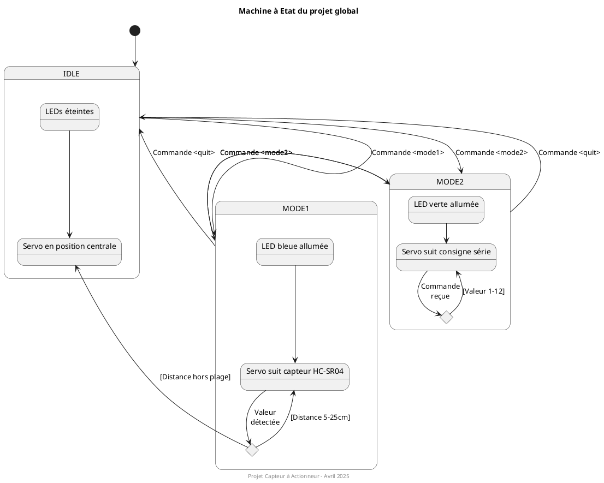

<h1 style="font-size: 24px;">Rapport de Projet : Du Capteur à l'Actionneur</h1>

<h2 style="font-size: 18px;">Sommaire</h2>

- [1. Introduction](#1-introduction)
  - [1.1 Objectif du projet](#11-objectif-du-projet)
  - [1.2 Modes de fonctionnement](#12-modes-de-fonctionnement)
  - [1.3 Machine à état](#13-machine-à-état)
  - [1.4 Comportements supplémentaires](#14-comportements-supplémentaires)
- [2. Conception](#2-conception)
  - [2.1 Diagramme de classe](#21-diagramme-de-classe)
  - [2.2 Diagrammes de séquence](#22-diagrammes-de-séquence)
    - [Diagramme de séquence principal](#diagramme-de-séquence-principal)
    - [Traitement des commandes utilisateur](#traitement-des-commandes-utilisateur)
    - [Mise à jour du système selon l'état](#mise-à-jour-du-système-selon-létat)
    - [Mode 1 - Suivi de distance](#mode-1---suivi-de-distance)
    - [Mode 2 - Consigne utilisateur](#mode-2---consigne-utilisateur)
  - [2.4 Brochage des différents éléments](#24-brochage-des-différents-éléments)
    - [Brochage du capteur HC-SR04](#brochage-du-capteur-hc-sr04)
    - [Brochage du servo-moteur](#brochage-du-servo-moteur)
    - [Brochage des LEDs](#brochage-des-leds)
    - [Brochage de la Communication série](#brochage-de-la-communication-série)
  - [2.4 Configuration des différents éléments](#24-configuration-des-différents-éléments)
    - [Configuration du servo-moteur](#configuration-du-servo-moteur)
    - [Configuration du capteur HC-SR04](#configuration-du-capteur-hc-sr04)
    - [Configuration de la communication série](#configuration-de-la-communication-série)
- [3. Modules développés](#3-modules-développés)
  - [3.1. Module HC-SR04](#31-module-hc-sr04)
    - [Fonctionnalités principales](#fonctionnalités-principales)
  - [3.2. Module Servo-moteur](#32-module-servo-moteur)
    - [Fonctionnalités principales](#fonctionnalités-principales-1)
    - [Détails techniques](#détails-techniques)
  - [3.3. Module UART](#33-module-uart)
    - [Fonctionnalités principales](#fonctionnalités-principales-2)
    - [Protocole de communication](#protocole-de-communication)
  - [3.4. Fonctions de démonstration](#34-fonctions-de-démonstration)
  - [3.5. Application principale](#35-application-principale)
    - [Fonctionnalités principales](#fonctionnalités-principales-3)
    - [Stratégie de conception](#stratégie-de-conception)
- [4. Difficultés rencontrées et solutions](#4-difficultés-rencontrées-et-solutions)
- [5. Conclusion](#5-conclusion)

## 1. Introduction

### 1.1 Objectif du projet

Ce projet vise à développer un système embarqué sur microcontrôleur STM32F4 permettant d'interfacer un capteur de distance à ultrasons (HC-SR04) avec un servo-moteur. L'objectif principal est de créer un système capable de réagir à l'environnement (mesure de distance) ou à des commandes utilisateur (via liaison série) pour positionner précisément un servo-moteur.

Le système met en œuvre différentes technologies et compétences en développement embarqué :

- Mesure de distance par ultrasons
- Génération de signaux PWM pour contrôler un servo-moteur
- Communication série formatée
- Gestion d'une machine à états
- Développement modulaire avec séparation des responsabilités

### 1.2 Modes de fonctionnement

Le système propose trois modes de fonctionnement distincts :

1. **Mode IDLE (repos)** :

   - Les LEDs sont éteintes
   - Le servo-moteur est positionné au centre (position neutre)
   - Le système attend une commande utilisateur

2. **Mode 1 (asservissement par capteur)** :

   - La LED bleue est allumée pour indiquer ce mode
   - Le servo-moteur se positionne proportionnellement à la distance mesurée par le capteur HC-SR04
   - Plage de mesure valide : 5 à 25 cm
   - Si la distance est hors de cette plage, le servo-moteur revient en position centrale

3. **Mode 2 (contrôle par commande série)** :
   - La LED verte est allumée pour indiquer ce mode
   - Le servo-moteur se positionne selon une valeur envoyée par l'utilisateur via UART
   - Plage de valeurs acceptées : 1 à 12 (correspondant à différentes positions angulaires)

### 1.3 Machine à état

Le système est géré par une machine à états dont les transitions sont déclenchées par les commandes utilisateur. Voici le diagramme d'états correspondant :

Ce diagramme illustre :

- Les trois états principaux du système (IDLE, MODE1, MODE2)
- Les transitions entre états déclenchées par les commandes utilisateur
- Les comportements spécifiques à chaque état
- La gestion des cas particuliers comme les mesures hors plage

### 1.4 Comportements supplémentaires

En plus des modes de fonctionnement principaux, le système offre les caractéristiques suivantes :

- **Protocole de communication série structuré** :

  - Les messages sont encapsulés entre délimiteurs '<' et '>'
  - Écho des caractères reçus pour confirmer la réception
  - Messages d'état et d'erreur formatés

- **Gestion des erreurs** :

  - Détection des valeurs hors plage pour le capteur
  - Vérification de la validité des commandes série
  - Messages d'erreur explicites pour guider l'utilisateur

- **Retour d'information** :
  - Affichage régulier de la distance mesurée en Mode 1
  - Confirmation des commandes reçues
  - Indication visuelle du mode actif par LEDs

## 2. Conception

### 2.1 Diagramme de classe

Le diagramme suivant illustre la structure du code et les relations entre les différents modules du système :

Ce diagramme met en évidence :

- La structure modulaire du système avec une séparation claire des responsabilités
- L'implémentation du pattern Singleton pour le capteur HC-SR04
- Les interfaces entre le contrôleur principal et les différents modules périphériques
- Les constantes et limitations définies pour chaque sous-système

### 2.2 Diagrammes de séquence

Les diagrammes de séquence suivants montrent les interactions entre les différents modules du système :

#### Diagramme de séquence principal

Le diagramme principal présente une vue d'ensemble des interactions du système avec des références vers les diagrammes détaillés :

Ce diagramme montre :

- La séquence d'initialisation
- La structure de la boucle principale
- Les références vers les diagrammes plus détaillés

#### Traitement des commandes utilisateur

Ce diagramme détaille le processus de réception et de traitement des commandes utilisateur :

Il montre :

- La réception des commandes via l'interface UART
- L'analyse et l'interprétation des commandes
- Les différentes actions selon le type de commande reçue

#### Mise à jour du système selon l'état

Ce diagramme illustre comment le système réagit en fonction de son état actuel :

Il montre :

- Les actions spécifiques pour chaque état (IDLE, MODE1, MODE2)
- Le traitement des mesures de distance en MODE1
- La gestion des positions du servo-moteur

#### Mode 1 - Suivi de distance

Le diagramme suivant spécifie comment fonctionne le Mode 1 :

Ce scénario montre :

- L'activation du Mode 1 par l'utilisateur
- La mesure continue de la distance
- L'ajustement du servo en fonction de la distance mesurée

#### Mode 2 - Consigne utilisateur

Le diagramme suivant spécifie comment fonctionne le Mode 2 :

Ce scénario montre :

- L'activation du Mode 2 par l'utilisateur
- L'envoi d'une valeur de position
- Le positionnement du servo selon la consigne reçue

### 2.4 Brochage des différents éléments

#### Brochage du capteur HC-SR04

| Broche | Connexion       | Description                                         |
| ------ | --------------- | --------------------------------------------------- |
| VCC    | Alimentation 5V | Alimentation du capteur                             |
| GND    | Masse           | Référence de masse                                  |
| Trig   | PA8 (GPIO)      | Signal de déclenchement de la mesure (sortie STM32) |
| Echo   | PA9 (GPIO)      | Signal de retour de l'écho (entrée STM32)           |

#### Brochage du servo-moteur

| Broche | Connexion       | Description                             |
| ------ | --------------- | --------------------------------------- |
| VCC    | Alimentation 5V | Alimentation du servo                   |
| GND    | Masse           | Référence de masse                      |
| Signal | PC6 (TIM3_CH1)  | Signal PWM pour le contrôle de position |

#### Brochage des LEDs

| LED        | Broche | Mode associé        | Signification             |
| ---------- | ------ | ------------------- | ------------------------- |
| LED Bleue  | PD15   | MODE1               | Mode capteur actif        |
| LED Verte  | PD12   | MODE2               | Mode commande série actif |
| LED Orange | PD13   | Indication          | Mesure valide (5-25 cm)   |
| LED Rouge  | PD14   | Indication d'erreur | Mesure hors plage         |

#### Brochage de la Communication série

| Broche | Connexion | Description             |
| ------ | --------- | ----------------------- |
| TX     | PA2       | Transmission de données |
| RX     | PA3       | Réception de données    |

### 2.4 Configuration des différents éléments

#### Configuration du servo-moteur

| Paramètre         | Valeur  | Description                                    |
| ----------------- | ------- | ---------------------------------------------- |
| Fréquence PWM     | 50 Hz   | Fréquence du signal de contrôle (période 20ms) |
| Position minimale | 1000 µs | Largeur d'impulsion pour 0°                    |
| Position centrale | 1500 µs | Largeur d'impulsion pour 90°                   |
| Position maximale | 2000 µs | Largeur d'impulsion pour 180°                  |
| Résolution        | 1 µs    | Résolution du positionnement                   |

#### Configuration du capteur HC-SR04

| Paramètre       | Valeur  | Description                                      |
| --------------- | ------- | ------------------------------------------------ |
| Durée trigger   | 10 µs   | Durée de l'impulsion de déclenchement            |
| Plage de mesure | 5-25 cm | Plage de distance valide pour l'application      |
| Timeout         | 10 ms   | Délai maximum d'attente pour l'écho              |
| Timer utilisé   | TIM1    | Timer haute résolution pour la mesure temporelle |
| Pull-down       | Activé  | Sur la broche Echo pour stabiliser le signal     |

#### Configuration de la communication série

| Paramètre       | Valeur       | Description                                     |
| --------------- | ------------ | ----------------------------------------------- |
| Interface       | USART2       | Interface série utilisée                        |
| Vitesse         | 115200 bauds | Débit de transmission                           |
| Format de trame | 8N1          | 8 bits de données, pas de parité, 1 bit de stop |
| Délimiteurs     | '<', '>'     | Caractères d'encapsulation des messages         |
| Timeout UART    | 1000 ms      | Timeout pour les opérations de transmission     |
| Taille buffer   | 256 octets   | Taille des buffers de réception et transmission |

## 3. Modules développés

### 3.1. Module HC-SR04

Le module HC-SR04 gère l'interfaçage avec le capteur ultrasonique pour mesurer la distance.

#### Fonctionnalités principales

- Initialisation des broches GPIO et du timer
- Génération d'impulsions précises de 10µs pour le trigger
- Mesure du temps d'écho avec une résolution microseconde
- Conversion du temps d'écho en distance (cm)
- Filtrage des mesures hors plage (5-25 cm)
- Mise à jour périodique des mesures en Mode 1

### 3.2. Module Servo-moteur

Le module servo-moteur permet de contrôler la position angulaire d'un servo standard via un signal PWM.

#### Fonctionnalités principales

- Initialisation du timer PWM (TIM3)
- Positionnement précis du servo à une valeur spécifiée
- Conversion de distances (5-25 cm) en positions servo (1000-2000 µs)
- Conversion de valeurs utilisateur (1-12) en positions servo
- Position centrale par défaut (1500 µs, 90°)

#### Détails techniques

- Signal PWM généré à 50Hz (période de 20ms)
- Largeur d'impulsion variable entre 1ms (0°) et 2ms (180°)
- Position centrale à 1.5ms (90°)
- Résolution temporelle de 1µs

### 3.3. Module UART

Le module UART gère la communication série avec l'utilisateur, offrant une interface formatée pour les commandes et les messages d'état.

#### Fonctionnalités principales

- Envoi de messages formatés avec délimiteurs
- Réception non-bloquante de commandes
- Écho des caractères reçus
- Gestion des dépassements de buffer
- Support pour les commandes textuelles et numériques

#### Protocole de communication

| Type de message | Format               | Exemple                     | Description                      |
| --------------- | -------------------- | --------------------------- | -------------------------------- |
| Commande mode   | `<commande>`         | `<mode1>`                   | Change le mode de fonctionnement |
| Valeur servo    | `<valeur>`           | `<8>`                       | Positionne le servo en Mode 2    |
| Information     | `<message>`          | `<Distance: 15.32 cm>`      | Retour d'information             |
| Erreur          | `<message d'erreur>` | `<Error: Message too long>` | Indication d'une erreur          |

Commandes reconnues :

- `mode1` : Active le Mode 1 (suivi par capteur)
- `mode2` : Active le Mode 2 (commande manuelle)
- `quit` : Retourne au mode IDLE
- `1` à `12` : Valeurs pour positionner le servo en Mode 2

### 3.4. Fonctions de démonstration

Pour valider le bon fonctionnement des différents modules, nous avons implémenté des fonctions de démonstration. Elles permettent de tester individuellement chaque composant (capteur HC-SR04, servo-moteur, UART) sans dépendre des autres parties du système.

Voici un résumé des fonctions de démonstration et des indicateurs de bon fonctionnement associés :

| **Module**      | **Fonction de démonstration** | **Indicateur de bon fonctionnement**                                                                                                                                                                                                |
| --------------- | ----------------------------- | ----------------------------------------------------------------------------------------------------------------------------------------------------------------------------------------------------------------------------------- |
| Capteur HC-SR04 | `HC_SR04_Demo`                | Affichage de LED indicatives :   • LED orange : distance valide (5-25 cm)   • LED rouge : distance hors plage ou erreur                                                                                                       |
| Servo-moteur    | `Servo_Demo`                  | Déplacement fluide entre les positions :   • minimale (0°),   • centrale (90°),   • maximale (180°).                                                                                                                       |
| UART            | `USART_Demo`                  | Test interactif :   • Envoi d'un message de test : "Testing USART communication... Please respond with <response> to continue."   • Réception et validation de la réponse utilisateur : "Response received: continuing demo." |

### 3.5. Application principale

L'application principale orchestre tous les modules et implémente la machine à états qui gère le comportement du système.

#### Fonctionnalités principales

- Initialisation de tous les périphériques
- Boucle principale non-bloquante
- Traitement des commandes utilisateur
- Gestion des transitions entre états
- Mise à jour périodique de l'état du système

#### Stratégie de conception

- **Architecture modulaire** : Chaque module a une responsabilité claire et bien définie
- **Machine à états** : Gestion explicite des états et transitions pour simplifier la logique
- **Gestion non-bloquante** : Aucune fonction ne bloque l'exécution, permettant au système de réagir en temps réel
- **Extensibilité** : Facilité d'ajout de nouveaux modes ou comportements

## 4. Difficultés rencontrées et solutions

| Problème                              | Description                                                                                               | Solution mise en œuvre                                                                                                                                                                           |
| ------------------------------------- | --------------------------------------------------------------------------------------------------------- | ------------------------------------------------------------------------------------------------------------------------------------------------------------------------------------------------ |
| **Précision des mesures**             | Fluctuations importantes dans les mesures du capteur HC-SR04, rendant le positionnement du servo instable | • Ajout d'un pull-down sur la broche Echo • Utilisation de TIM1 pour mesurer avec une résolution de 1µs • Implémentation de timeouts (10ms) • Filtrage des valeurs hors plage (5-25 cm) |
| **Communication série bloquante**     | Les premières implémentations de la communication série bloquaient l'exécution principale                 | • Réception non-bloquante des caractères • Gestion d'état pour reconstituer les commandes • Utilisation de délimiteurs '<' et '>' • Buffer statique pour conserver l'état entre appels  |
| **Stabilité du servo**                | Servo instable lors de petits changements de distance                                                     | • Limitation de la fréquence de mise à jour (100ms) • Position centrale par défaut en cas d'erreur                                                                                            |
| **Dysfonctionnement du servo-moteur** | Après plusieurs essais, le servo-moteur a cessé de répondre correctement aux commandes                    | • Test valide avec un autre servo-moteur  • Vérification de la connexion électrique • Changement d'un fil de connexion                                                                  |

## 5. Conclusion

Ce projet a permis de développer un système complet intégrant capteur et actionneur, avec une interface utilisateur série. Les principales réalisations sont :

1. **Architecture modulaire** : Le système est divisé en modules réutilisables avec des interfaces claires
2. **Machine à états robuste** : La gestion explicite des états simplifie la logique et rend le comportement prévisible
3. **Interface utilisateur intuitive** : Les commandes simples et le retour d'information constant facilitent l'utilisation
4. **Fiabilité** : La gestion des erreurs, les timeouts et les vérifications de plages assurent un fonctionnement robuste
